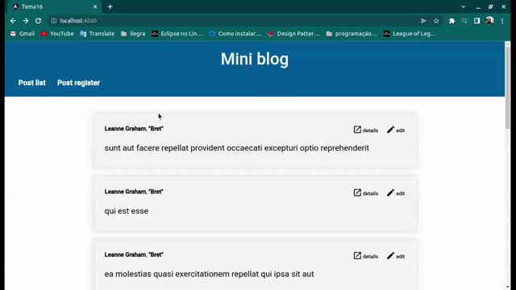
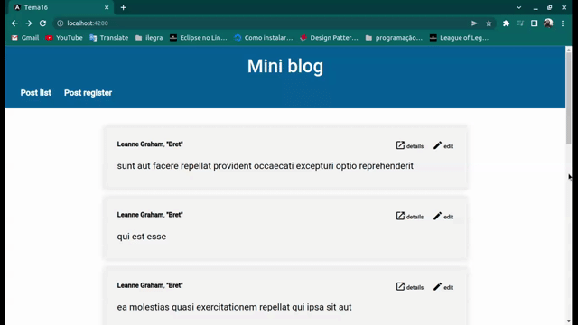

# Mini blog

This project was generated with [Angular CLI](https://github.com/angular/angular-cli) version 13.1.2.

## Installing dependencies and running project

Run `npm install` to install dependencies and `npm start` to start the project in
`http://localhost:4200/`.

## Running unit tests

Run `ng test` to execute the unit tests or `ng test --code-coverage` to execute the unit test with coverage stats via [Karma](https://karma-runner.github.io).

## Project description

The purpose of this project is to be a kind of mini-blog, that you can create post, edit post and create comments. All posts are listed on homepage, so the post module will be loaded
from the start by lazy loading on app root. All data is faked, for that jsonplaceholder api is used on service, the data is not actually being created or updated. Angular material is especially used on form fields and post listing pagination. The feedback's forms is given using ngx-toastr library.

## Dependencies

ngx-toastr
Angular material

    
<strong>Post register example</strong>

    

 

    
<strong>Post edit example</strong>

    

 

    
<strong>Post details example</strong>

    

